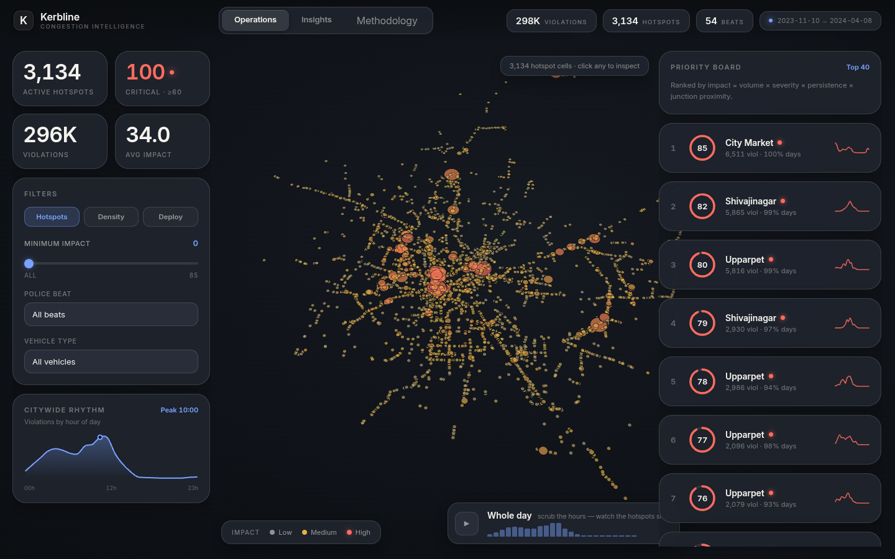
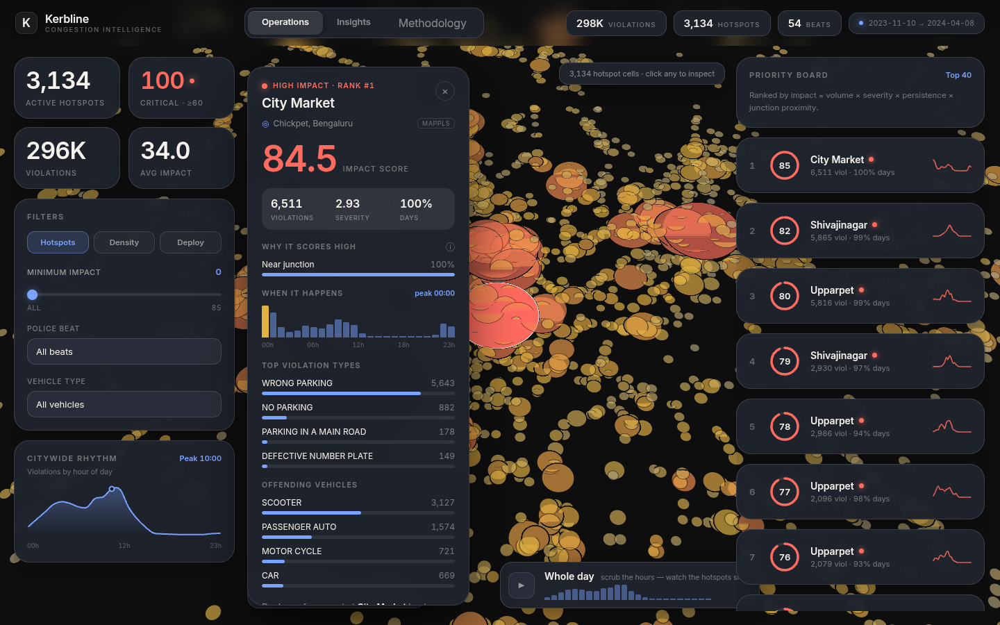
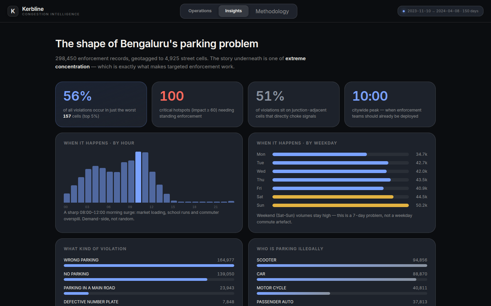
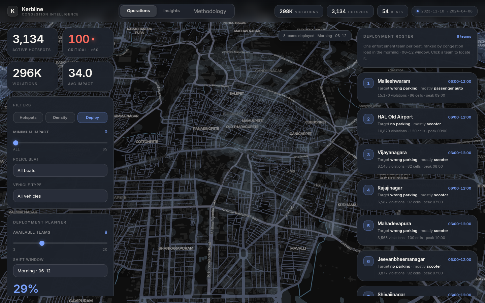

# Kerbline

**Parking-induced congestion intelligence for the Bengaluru Traffic Police.**

Live demo: **[kerbline.vercel.app](https://kerbline.vercel.app)** · Built for the Gridlock Hackathon 2.0 (Theme 1)

Bengaluru logs hundreds of thousands of parking violations, but enforcement still runs on instinct. Patrols go where they always go. Kerbline reads six months of that record (298,450 violations) and turns it into something an officer can act on: a ranked map of the cells where illegal parking most plausibly chokes traffic, and a plan for how many teams to send, to which beats, in which shift.



## The idea

Not all illegal parking hurts equally. A footpath violation on a quiet lane is not a main-road blockage at a junction during the morning peak. The dataset records *where* people park illegally, but it has no speed or flow feed, and external data is off-limits. So instead of faking a congestion number, Kerbline derives a transparent **Congestion Impact Score** from four signals already in the violations:

```
impact = 100 × ( 0.40·volume + 0.30·severity + 0.20·persistence + 0.10·junction )
```

| Factor | What it measures | How it's normalised |
|---|---|---|
| Volume (0.40) | how much the cell absorbs over 5 months | `log(1+n) ÷ log(1+max)`, so one runaway cell doesn't flatten the rest |
| Severity (0.30) | how much the offence blocks the carriageway | main-road / crossing / double parking = 5, plate offences = 1, scaled `(s−1)÷4` |
| Persistence (0.20) | chronic spot or one-off | share of the 150-day window the cell was active |
| Junction (0.10) | junction-adjacent blocking backs up the signal | share of the cell's violations near a named junction |

Every cell gets a 0–100 score. The top of the city is **City Market at 84.5** — and the app rebuilds that number live, factor by factor, in the Methodology panel.

## What's inside

Three screens, one story: explore the problem, prove it's concentrated, then act on it.

### Operations

Every 180-metre cell on a live map, coloured by impact. Filter by beat, vehicle, or minimum impact. A time-of-day scrubber animates how congestion shifts across 24 hours, so "deploy at the right hour" is something you can see, not just assert. Click any hotspot for its full profile.



The detail panel breaks down why a cell scores high and resolves it to a real Bengaluru place using Mappls — City Market shows up as **Chickpet**, Upparpet as **Gandhi Nagar / Majestic**. These are the corridors a traffic officer would name without being asked.

### Insights

The analytics behind the pitch. The headline is concentration: the worst 5% of cells hold roughly 65% of all violations, and just 118 of 4,925 cells cover half the city. That's the whole reason a handful of roving teams can move the needle.



### Deployment Planner

The part an officer actually uses. Pick a team count and a shift; Kerbline groups hotspots by police beat, scores each beat by the impact realised in that shift, assigns one team per top beat, and reports honest coverage. Eight teams cover about 29% of the morning's congestion impact, and changing the shift genuinely reshuffles the assignment.



## Does the score hold up?

A hand-built score invites one fair objection: "you made the weights up." There's no flow ground truth to test against, so we can't prove the score is *correct* — but we can show it isn't arbitrary, with four checks that all reproduce from the dataset alone. They live in the Methodology panel.


- **The weights aren't load-bearing.** Re-run the score 2,000 times with every weight shifted ±50%: the ranking barely moves (median Spearman ρ = 0.99), and 95% of the top 20 stay top 20. Even forcing all four weights equal holds ρ = 0.93.
- **It's structural, not noise.** Split the six months in half and score each independently: ρ = 0.80, and 75% of the top hotspots recur in both halves.
- **An outside signal agrees.** The number of distinct violation types a cell attracts is never used in the score, yet tracks it (ρ = 0.66).
- **A real-world cross-reference.** Every top hotspot resolves to a recognised commercial or transit core via Mappls — Chickpet, Majestic, KR Market. Mappls names the places; it never feeds the score.

## How it's built

Static precompute, static frontend. A Python pipeline crunches the dataset once into small JSON files; the Next.js app reads them. No live backend, so it's demo-proof, deploys anywhere, and runs fully offline.

```
Dataset.csv → pipeline/build_data.py (+ validate.py, validate_external.py) → web/public/data/*.json → Next.js + deck.gl
```

- **Frontend:** Next.js 15 (App Router), React 19, deck.gl 9, react-map-gl / MapLibre, hand-written CSS. First load ~117 kB.
- **Pipeline:** Python 3, pandas, numpy.

## Running it

```bash
# 1. build the data (needs Dataset.csv in the repo root — see note below)
python pipeline/build_data.py

# 1b. (optional) stress-test the score → web/public/data/validation.json
python pipeline/validate.py

# 1c. (optional) enrich hotspots with Mappls partner place names
#     needs a Mappls static key: export MAPPLS_API_KEY=...
python pipeline/validate_external.py --top --n 50

# 2. run the frontend
cd web
npm install
npm run build && npm start    # http://localhost:3000
```

> **Dataset.** `Dataset.csv` (the official challenge data, ~105 MB) isn't committed — it's over GitHub's file limit and isn't ours to redistribute. The precomputed `web/public/data/*.json` are included, so the app runs without it; you only need the CSV to re-run the pipeline.

## Compliance

The analytical core is the official challenge dataset, only. Every hotspot, score, and figure is computed from `Dataset.csv`. The single outside touch is Mappls (MapmyIndia), an official hackathon partner whose API the organisers confirmed teams may use — and we use it only to attach place names to hotspots, never as an input to the score. Remove it and every number is unchanged.
